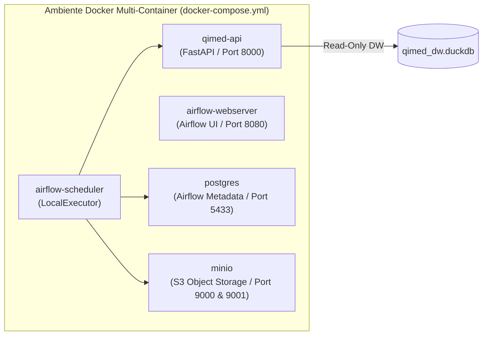
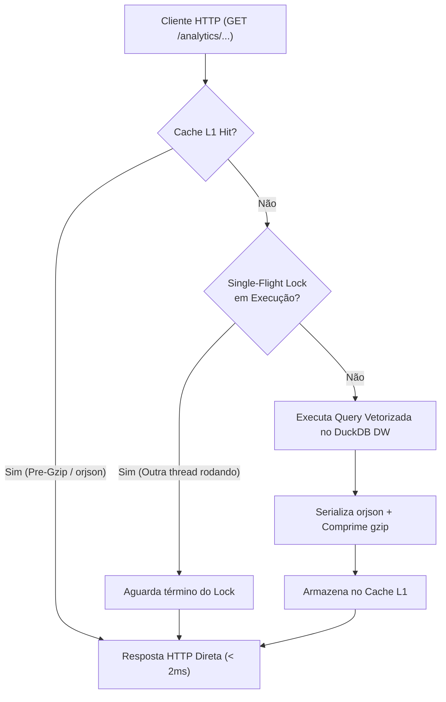

# 🏛️ Documentação Completa de Arquitetura, Infraestrutura e Engenharia — QIMED Lakehouse

---

## 1. 📌 Resumo Executivo e Visão Geral do Projeto

O **QIMED Lakehouse** é uma plataforma analítica e operacional de **Engenharia de Dados em Saúde**, desenvolvida para unificar, auditar, transformar e disponibilizar em alta velocidade dados heterogêneos de **Saúde Pública (SUS / DATASUS)** e **Saúde Suplementar (ANS)** no Brasil.

### 🎯 Objetivos Estratégicos
1. **Auditoria Forense de Contas Médicas e AIHs:** Identificação automatizada de inconformidades de faturamento, divergências de procedimentos solicitados vs. executados e cobranças acima do percentil 99 do SUS.
2. **Benchmark e Detecção de Outliers Setoriais da ANS:** Identificação robusta de operadoras atípicas de planos de saúde via **Median Absolute Deviation (MAD)** e **Modified Z-Score**, mitigando fraudes e distorções na taxa de glosa setorial.
3. **Eficiência Hospitalar e Eventos Sentinela:** Monitoramento de tempo médio de permanência (LOS), mortalidade hospitalar, razão de custo óbito vs. alta e Internações por Condições Sensíveis à Atenção Primária (ICSAP).
4. **Governança Estrita, LGPD e Resolução Territorial:** Conformidade total com a Lei Geral de Proteção de Dados Pessoais (LGPD) com pseudoanonimização determinística (Salt + Hash) e cruzamento territorial oficial via catálogo de 5.571 municípios do IBGE e cadastro oficial do CNES do Ministério da Saúde.
5. **Acesso Analítico Sub-milissegundo:** API REST assíncrona de alta disponibilidade baseada em **FastAPI**, **DuckDB** colunar in-process, serialização binária com **orjson**, compressão **gzip** on-the-fly e cache com **Single-Flight Lock** contra *Cache Stampede*.

---

## 2. 🏗️ Arquitetura de Dados Medallion (Bronze $\to$ Silver $\to$ Gold)

O QIMED adota a **Arquitetura Medallion** em 3 camadas lógicas e físicas:

```mermaid
flowchart TD
    subgraph INGESTAO["1. Fontes de Dados & Ingestão"]
        D1["FTP DATASUS\n(SIH: RD, RJ, ER | SIA: PA | CNES: ST)"]
        D2["ANS / CADOP\n(Ressarcimento SUS | Operadoras)"]
        D3["Ministério da Saúde API / IBGE\n(Dados Abertos CNES | Catálogo IBGE)"]
        D4["FHIR R4 / EMR\n(Bundles Clínicos JSON)"]
    end

    subgraph BRONZE["2. Camada Bronze (Raw Ingestion)"]
        B1["DBC -> DBF -> PyArrow RecordBatches"]
        B2["Delta Lake / S3 MinIO\n(Particionado: ano/mes/uf)"]
        B3["Schema Drift Detector & Lock Manager"]
    end

    subgraph SILVER["3. Camada Silver (Conformed & Governed)"]
        S1["LGPD Hash + Salt Secreto\n(CPF/CNS Anonimizados)"]
        S2["Master Patient Index (MPI)\n(Resolução Unificada de Paciente)"]
        S3["Mappers Semânticos Canônicos\n(SIH, SIA, CNES, CID-10, IBGE)"]
        S4["Fatos & Dimensões Silver:\nfct_internacao, fct_ressarcimento_sus,\ndim_operadoras_saude, dim_paciente"]
    end

    subgraph GOLD["4. Camada Gold (Data Warehouse & Serving)"]
        G1["DuckDB DW Colunar\n(warehouse/qimed_dw.duckdb)"]
        G2["Dimensões Conformed:\ndim_estabelecimento (IBGE + CNES),\ndim_operadoras_saude, dim_cid10, dim_tempo"]
        G3["Data Marts Pré-Agregados:\ndm_ans_glosas_operadoras,\ndm_kpi_dashboard_financeiro,\ndm_hospitais_eficiencia, dm_glosas_auditoria"]
        G4["Tabela Física de Auditoria Operacional:\naud_alertas_anomalias (121k+ alertas)"]
    end

    subgraph SERVING["5. Camada de Aplicação & Consumo"]
        API["FastAPI REST Engine\n(Uvicorn + orjson + Single-Flight Cache)"]
        UI["Painéis Analíticos & Swagger UI\n(http://localhost:8000/docs)"]
    end

    INGESTAO --> BRONZE
    BRONZE --> SILVER
    SILVER --> GOLD
    GOLD --> SERVING
```



---

### 2.1. Camada Bronze (Raw Ingestion)
* **Objetivo:** Ingestão bruta, imutável e auditável de microdados em formato colunar particionado.
* **Formatos de Entrada:** 
  * Arquivos comprimidos legados do DATASUS (`.dbc`), descompactados via algoritmo LZO nativo (`pyreaddbc` $\to$ `.dbf` $\to$ `dbfread`).
  * Arquivos CSV / Open Data e JSON FHIR R4.
* **Processamento:** Streaming em blocos com **Apache Arrow RecordBatches** (`pa.RecordBatch`), garantindo consumo de memória estritamente constante ($\le 250\text{ MB}$ de RAM), mesmo processando arquivos estaduais com milhões de linhas.
* **Armazenamento:** Delta Lake / Parquet local e S3 (MinIO Object Storage) particionado por `ano=YYYY/mes=MM/uf=XX`.
* **Detecção de Schema Drift:** Módulo [`src/quality/schema_drift_detector.py`](file:///c:/Users/marlo/Downloads/QIMED/src/quality/schema_drift_detector.py) valida contratos de campos antes da escrita.

### 2.2. Camada Silver (Conformed, Governed & Cleansed)
* **Objetivo:** Limpeza, padronização semântica, validação de regras de negócio e anonimização de dados pessoais sensíveis.
* **Anonimização LGPD ([`src/lgpd/anonymizer.py`](file:///c:/Users/marlo/Downloads/QIMED/src/lgpd/anonymizer.py)):**
  * CPF, CNS (Cartão Nacional de Saúde), AIH e nomes de pacientes são submetidos a função hash determinística criptografada:
    $$\text{ID\_Anonimizado} = \text{HMAC-SHA256}(\text{Dado\_Sensivel} \,\|\, \text{SALT\_SECRET})$$
* **Master Patient Index (MPI) ([`src/mpi/`](file:///c:/Users/marlo/Downloads/QIMED/src/mpi)):**
  * Unificação probabilística e determinística de pacientes entre sistemas desconectados (SIH vs. SIA vs. EMR).
* **Mapeamento Semântico Canônico:**
  * [`src/silver/mappers/sih_mapper.py`](file:///c:/Users/marlo/Downloads/QIMED/src/silver/mappers/sih_mapper.py): Conversão de 115 colunas do DATASUS SIH para campos canônicos padronizados.
  * [`src/silver/mappers/cnes_mapper.py`](file:///c:/Users/marlo/Downloads/QIMED/src/silver/mappers/cnes_mapper.py): Normalização de tipologias de unidades de saúde e vínculos SUS.
  * [`src/silver/ibge_nacional.py`](file:///c:/Users/marlo/Downloads/QIMED/src/silver/ibge_nacional.py): Resolução geográfica com catálogo oficial dos 5.571 municípios.
* **Tabelas Fato e Dimensões Silver:**
  * `fct_internacao`: 1.240.124 linhas (microdados de internação hospitalar SUS).
  * `fct_ressarcimento_sus`: 1.236.379 linhas (valores faturados, recolhidos e glosados por operadoras ANS).
  * `dim_operadoras_saude`: 1.115 operadoras ativas registradas na ANS.

### 2.3. Camada Gold (Data Warehouse & Semantic Serving)
* **Objetivo:** Tabelas dimensionais conformed e Data Marts pré-agregados modelados para consultas analíticas instantâneas ($O(1)$) e auditoria hospitalar.
* **Engine:** **DuckDB DW** colunar embedded (`warehouse/qimed_dw.duckdb`), com transações ACID, vetorização SIMD e execução nativa multithreaded.
* **Tabelas Materializadas:**
  1. `dim_estabelecimento`: Dimensão canônica com 4.282 estabelecimentos de saúde reais, enriquecida com catálogo oficial do IBGE e CNES oficial do Ministério da Saúde.
  2. `dm_ans_glosas_operadoras`: Data Mart dimensional de operadoras de planos de saúde da ANS com KPIs de glosa inicial, glosa final, guias sem retorno e metodologia MAD.
  3. `dm_kpi_dashboard_financeiro` & `dm_kpi_permanencia_faixa`: Indicadores consolidados de ticket médio, custo por desfecho (óbito vs. alta) e faixas de permanência.
  4. `dm_glosas_auditoria`: Distribuição de glosas hospitalares por motivo e impacto financeiro.
  5. `dm_hospitais_eficiencia`: Taxas de ocupação de leitos, mortalidade e tempo médio de permanência por hospital.
  6. `aud_alertas_anomalias`: Tabela física com mais de **121.500 alertas** de inconformidades clínicas e financeiras.

---

## 3. ⚙️ Infraestrutura de Execução e Containerização (Docker & Airflow)

O ecossistema é orquestrado via **Docker Compose** e **Apache Airflow 2.x**:



### 3.1. Serviços Containerizados

| Serviço | Container | Imagem / Base | Porta | Finalidade |
| :--- | :--- | :--- | :---: | :--- |
| **QIMED API** | `qimed-qimed-api-1` | Python 3.11 / Uvicorn | `8000` | Servir endpoints analíticos REST em modo assíncrono com cache ultrarrápido. |
| **Airflow Webserver** | `qimed-airflow-webserver-1` | Apache Airflow 2.x | `8080` | Interface visual de monitoramento e disparo de DAGs de Engenharia de Dados. |
| **Airflow Scheduler** | `qimed-airflow-scheduler-1` | Apache Airflow 2.x | — | Agendamento e execução de pipelines via `LocalExecutor`. |
| **PostgreSQL** | `qimed-postgres-1` | Postgres 13 | `5433:5432` | Banco de metadados transacional do Airflow. |
| **MinIO (S3)** | `qimed-minio` | MinIO Latest | `9000`, `9001` | Object Storage local compatível com Amazon S3 para data lakes Bronze e Silver. |

### 3.2. Catálogo de DAGs do Airflow (`dags/`)

1. [`dag_datasus_sih.py`](file:///c:/Users/marlo/Downloads/QIMED/dags/dag_datasus_sih.py): Coleta e ingestão de AIHs do SIH/SUS (`RD`).
2. [`dag_datasus_sih_rejeicoes_glosas.py`](file:///c:/Users/marlo/Downloads/QIMED/dags/dag_datasus_sih_rejeicoes_glosas.py): Ingestão de AIHs rejeitadas (`RJ`) e erros/críticas (`ER`).
3. [`dag_datasus_sia.py`](file:///c:/Users/marlo/Downloads/QIMED/dags/dag_datasus_sia.py): Produção ambulatorial e consultas de alta complexidade (`PA`).
4. [`dag_datasus_cnes.py`](file:///c:/Users/marlo/Downloads/QIMED/dags/dag_datasus_cnes.py): Cadastro Nacional de Estabelecimentos de Saúde (`ST`, `LT`, `EQ`).
5. [`dag_ans_supplementary_health.py`](file:///c:/Users/marlo/Downloads/QIMED/dags/dag_ans_supplementary_health.py): Ingestão do Ressarcimento ao SUS e operadoras da ANS.
6. [`dag_silver_transformation.py`](file:///c:/Users/marlo/Downloads/QIMED/dags/dag_silver_transformation.py): Pipelines de padronização, limpeza e anonimização LGPD.
7. [`dag_gold_aggregation.py`](file:///c:/Users/marlo/Downloads/QIMED/dags/dag_gold_aggregation.py): Construção dos Data Marts analíticos e tabelas dimensionais Gold.
8. [`dag_data_quality_audit.py`](file:///c:/Users/marlo/Downloads/QIMED/dags/dag_data_quality_audit.py): Auditoria automatizada de integridade referencial e contratos.
9. [`dag_qimed_end_to_end.py`](file:///c:/Users/marlo/Downloads/QIMED/dags/dag_qimed_end_to_end.py): Execução orquestrada ponta a ponta (Bronze $\to$ Silver $\to$ Gold $\to$ Cache).

---

## 4. 🚀 Motor Analítico e Endpoints da API REST

A API foi desenvolvida em **FastAPI** assíncrona ([`src/api/`](file:///c:/Users/marlo/Downloads/QIMED/src/api)), equipada com uma arquitetura de cache multicamadas de alta performance:

### 4.1. Camada de Cache e Concorrência ([`src/api/cache.py`](file:///c:/Users/marlo/Downloads/QIMED/src/api/cache.py))
* **Cache L1 (In-Memory Pre-Serialized):** Armazena a resposta binária já serializada em **`orjson`** e pré-comprimida em **`gzip`**, permitindo entrega direta na conexão TCP sem overhead de CPU.
* **Single-Flight Lock (`_single_flight_locks`):** Previne o problema clássico de *Cache Stampede*. Quando 1.000 requisições simultâneas requisitam uma chave não cacheada, apenas **uma única thread** executa a consulta no DuckDB; as outras 999 aguardam o resultado e consomem o cache instantaneamente.
* **Epoch-Based Cache Invalidation:** Ao atualizar o status de uma anomalia ou rodar uma nova carga, a versão da época é incrementada, invalidando o cache do período afetado sem necessidade de limpar toda a memória do servidor.



### 4.2. Matriz de Endpoints Analíticos

| Método | Endpoint | Módulo / Função | Descrição |
| :---: | :--- | :--- | :--- |
| `GET` | `/api/v1/analytics/dashboard/financeiro` | `get_dashboard_financeiro` | Retorna KPIs financeiros, gráfico de Pareto de glosas, custos por permanência e série temporal em requisição consolidada. |
| `GET` | `/api/v1/analytics/central-anomalias` | `get_central_anomalias_grid` | Grid operacional da Central de Anomalias (SIH) com 4 cards de KPI, Top 5 hospitais, distribuição por tipo e paginação inteligente. |
| `GET` | `/api/v1/analytics/central-anomalias/{id_alerta}` | `get_drilldown_central_anomalia` | Modal de Drilldown Individual com dados do alerta, contexto hospitalar oficial do CNES/IBGE e série histórica. |
| `PATCH` | `/api/v1/analytics/central-anomalias/{id_alerta}/status` | `update_status_central_anomalia` | Transação de workflow de auditoria (`NOVA` $\to$ `EM_ANALISE` $\to$ `RESOLVIDA` / `IGNORADA`) com invalidação de cache. |
| `GET` | `/api/v1/analytics/painel-glosa-ans` | `get_painel_glosa_ans` | Painel de Glosa da Saúde Suplementar (ANS) com KPIs setoriais, detector MAD de outlier e agrupamentos multidimensionais. |
| `GET` | `/api/v1/analytics/glosas/operadoras` | `get_glosas_operadoras` | Alias de compatibilidade para listagem paginada de operadoras. |
| `GET` | `/api/v1/analytics/glosas/auditoria` | `get_glosas_auditoria` | Distribuição de glosas hospitalares auditadas por UF. |
| `GET` | `/api/v1/analytics/hospitais/eficiencia` | `get_hospitais_eficiencia` | Indicadores de eficiência clínica, taxa de ocupação e permanência média por hospital. |
| `GET` | `/api/v1/analytics/icsap` | `get_icsap` | Monitoramento de Internações por Condições Sensíveis à Atenção Primária. |
| `GET` | `/api/v1/analytics/cache/stats` | `get_cache_observability_stats` | Telemetria do sistema: taxa de acerto de cache, tempo de reconstrução e métricas de memória. |

---

## 5. 🧠 Metodologias Estatísticas e Algoritmos de Detecção de Anomalias

O Lakehouse implementa duas metodologias matemáticas fundamentais:

### 5.1. Modified Z-Score baseado em MAD (Median Absolute Deviation)
Implementado em [`src/analytics/outliers.py`](file:///c:/Users/marlo/Downloads/QIMED/src/analytics/outliers.py) (*Iglewicz & Hoaglin, 1993*), utilizado para identificar operadoras atípicas no setor de saúde suplementar:

#### Formulação Matemática:
1. **Mediana do Setor:** $\tilde{X} = \text{mediana}(X)$
2. **Desvio Absoluto Mediano:**
   $$\text{MAD} = \text{mediana}\Big(\big| X_i - \tilde{X} \big|\Big)$$
3. **Modified Z-Score ($M_i$):**
   $$M_i = \frac{0{,}6745 \cdot (X_i - \tilde{X})}{\text{MAD}}$$

#### Vantagens Estatísticas:
* **Imunidade ao Efeito Máscara (*Masking Effect*):** O desvio padrão clássico ($\sigma$) é inflacionado pelo próprio outlier, mascarando outras anomalias.
* **Ponto de Ruptura (*Breakdown Point*):** Atinge $50\%$ de tolerância a contaminação amostral, contra $0\%$ da média aritmética tradicional.
* **Critérios de Disparo:**
  1. $M_i \ge 3{,}5$ (desvio extremo em relação à curva mediana); **OU**
  2. $\text{Concentração Individual} \ge 50\%$ do volume financeiro total de glosas do país.

---

### 5.2. Motor de Inconformidades Clínicas e Faturamento Hospitalar (SUS)
Implementado em [`src/gold/models/kpi_central_anomalias.py`](file:///c:/Users/marlo/Downloads/QIMED/src/gold/models/kpi_central_anomalias.py):

#### Regras Mapeadas:
1. **Divergência de Procedimento (`DIVERGENCIA_PROCEDIMENTO` / Crítica):** $\texttt{PROC\_SOLIC} \neq \texttt{PROC\_REA}$.
2. **Outlier de Custo Extremo (`OUTLIER_CUSTO_P99` / Crítica):** $\texttt{valor\_total\_brl} > P_{99}$ para o mesmo procedimento.
3. **Glosa de Diárias Prolongadas de UTI (`GLOSA_SUS` / Alta):** $\text{UTI} > 0 \text{ e } \text{Dias} > 25$.
4. **Inconformidade de AIH Zerada (`AIH_VALOR_ZERO` / Média):** $\text{AIH Inicial e } \texttt{valor\_total\_brl} \le 0$.
5. **Óbito em Menos de 24 Horas (`OBITO_PERMANENCIA_ZERO` / Crítica):** $\text{Óbito = True e Dias = 0}$.

---

## 6. 📂 Estrutura de Diretórios e Módulos do Repositório

```text
QIMED/
├── config/                                 # Catálogos Oficiais e Configurações
│   ├── dim_cnes_datasus.parquet           # Catálogo Oficial CNES (4.282 estabelecimentos)
│   ├── dim_municipios_ibge.parquet        # Catálogo Oficial IBGE (5.571 municípios)
│   ├── dim_cid10_datasus.parquet          # Tabela Canônica de Diagnósticos CID-10
│   └── sources.yaml                       # Mapeamento de fontes e paths do Lakehouse
│
├── dags/                                   # Orquestração de Pipelines (Airflow 2.x)
│   ├── dag_qimed_end_to_end.py            # Pipeline mestre ponta a ponta
│   ├── dag_datasus_sih.py                 # Coletor SIH / AIH Reduzida
│   ├── dag_datasus_cnes.py                # Coletor CNES (Estabelecimentos)
│   ├── dag_ans_supplementary_health.py    # Coletor ANS (Ressarcimento e Operadoras)
│   ├── dag_silver_transformation.py       # Transformação e Governança Silver
│   └── dag_gold_aggregation.py            # Agregação e Materialização Gold
│
├── src/                                    # Código-Fonte do Lakehouse e Aplicações
│   ├── analytics/                         # Algoritmos Analíticos e Estatísticos
│   │   └── outliers.py                    # Motor Modified Z-Score / MAD
│   ├── api/                               # Camada de Aplicação REST (FastAPI)
│   │   ├── cache.py                       # Cache L1/L2 com Single-Flight e Pre-Gzip
│   │   ├── duckdb_query_engine.py         # Motor de consultas SQL otimizadas no DW
│   │   ├── main.py                        # Ponto de entrada FastAPI e Middlewares
│   │   └── routers/                       # Roteadores de Endpoints (analytics, uploads)
│   ├── collectors/                        # Coletores de Dados Especializados
│   │   ├── base.py                        # Classe base com streaming Arrow
│   │   └── datasus_collector.py           # Coletor FTP DATASUS com descompressão DBC
│   ├── gold/                              # Modelagem Dimensional Gold
│   │   ├── models/                        # Modelos Dimensionais e Fatos
│   │   │   ├── dim_estabelecimento.py     # Dimensão Estabelecimentos (IBGE + CNES)
│   │   │   ├── kpi_glosas_operadoras_ans.py # Data Mart de Glosas ANS
│   │   │   ├── kpi_central_anomalias.py   # Motor e tabela aud_alertas_anomalias
│   │   │   ├── kpi_nacional_eficiencia.py # Data Mart de Eficiência Hospitalar
│   │   │   └── views_semanticas.py        # Views analíticas padronizadas
│   │   └── pipeline_nacional.py           # Orquestrador de Carga da Camada Gold
│   ├── silver/                            # Mapeamentos e Transformações Silver
│   │   ├── mappers/                       # Mappers Semânticos (SIH, CNES, FHIR)
│   │   ├── ibge_nacional.py               # Enriquecimento Territorial IBGE
│   │   └── cid10_nacional.py              # Resolução Diagnóstica CID-10
│   ├── lgpd/                              # Módulo de Segurança e Privacidade
│   │   └── anonymizer.py                  # Anonimizador Criptográfico Determinístico
│   ├── mpi/                               # Master Patient Index
│   ├── quality/                           # Garantia de Qualidade de Dados
│   │   └── schema_drift_detector.py       # Validador de Contratos e Schema Drift
│   └── utils/                             # Utilitários de Log, Config e Sistema
│
├── tests/                                  # Suíte de Testes Automatizados (Pytest)
│   ├── test_dim_estabelecimento_production.py # Testes de produção da dim_estabelecimento
│   ├── test_dm_ans_glosas_production.py   # Testes de produção do DM de Glosas ANS
│   ├── test_painel_glosa_ans.py           # Testes dos endpoints do Painel ANS
│   ├── test_drilldown_anomalia.py         # Testes da Central de Anomalias e Drilldown
│   └── test_performance_architecture_complete.py # Testes de concorrência e cache L1
│
├── warehouse/                              # Armazenamento do Data Warehouse
│   └── qimed_dw.duckdb                    # Banco de Dados Colunar DuckDB Gold
│
├── docker-compose.yml                      # Orquestração Multi-Container do Projeto
├── Dockerfile                              # Imagem de Produção do QIMED
├── requirements.txt                        # Dependências Python do Projeto
└── README.md                               # Documentação de Instalação e Execução
```

---

## 7. 📦 Stack Tecnológico e Bibliotecas

| Biblioteca / Tecnologia | Versão | Função Primária no QIMED |
| :--- | :---: | :--- |
| **DuckDB** | `^0.10+` | Motor OLAP colunar vetorial in-process. Executa consultas complexas com agregação de milhões de linhas em milissegundos. |
| **FastAPI** | `^0.110+` | Framework assíncrono de altíssimo desempenho para a API REST dos painéis e auditoria. |
| **Uvicorn** | `^0.28+` | Servidor ASGI concorrente para execução da API em produção. |
| **Apache Arrow / PyArrow** | `^15.0+` | Formato padrão de memória colunar em streaming (`RecordBatch`) para ingestão sem vazamento de RAM. |
| **Delta Lake (`deltalake`)** | `^0.16+` | Formato aberto de armazenamento transacional ACID com versionamento para as camadas Bronze e Silver. |
| **NumPy & SciPy** | `^1.26+` | Computação estatística vetorizada (cálculo de MAD, percentis e matrizes de correlação). |
| **Pandas / Polars** | `^2.2+` | Manipulação tabular estruturada e interoperabilidade com Parquet. |
| **PyReadDBC & DBFRead** | `Latest` | Descompressão do algoritmo LZO proprietário do DATASUS (`.dbc` $\to$ `.dbf`). |
| **Orjson** | `^3.9+` | Serializador JSON em C/Rust ultrarrápido, utilizado no pipeline de cache pré-compilado. |
| **Pydantic** | `^2.6+` | Validação estrita de contratos de dados e schemas das requisições e respostas. |
| **Pytest** | `^8.0+` | Framework de testes unitários, testes de integração e validação de contratos dimensionais. |
| **Apache Airflow** | `2.8+` | Orquestrador de DAGs de engenharia de dados com LocalExecutor e catálogo de tarefas. |
| **MinIO** | `Latest` | Object Storage local compatível com Amazon S3 para simulação de Cloud Lakehouse. |
| **PostgreSQL** | `13+` | Banco de dados relacional de metadados do Airflow e controle transacional. |
| **Docker & Docker Compose** | `^24+` | Containerização isolada e reproduzível de todos os microsserviços. |

---

## 8. 🛡️ Qualidade de Dados, Contratos e Governança

### 8.1. Princípios de Engenharia Aplicados
1. **Regra Fundamental de Dados Reais:** É estritamente proibido inventar, simular ou inferir atributos hospitalares a partir de heurísticas arbitrárias. Se a informação não existir na fonte oficial, o campo permanece `NULL`.
2. **Resolução Territorial Determinística:** Todo município hospitalar é resolvido exclusivamente contra os códigos de 6 e 7 dígitos do catálogo oficial do IBGE.
3. **Fail-Fast em Contratos:** Pipelines falham imediatamente com `ValueError` descritivo caso tabelas ou colunas obrigatórias da camada Silver estejam ausentes, impedindo a criação de tabelas Gold corrompidas ou vazias.
4. **Idempotência Dimensional:** A execução repetida de qualquer pipeline de materialização (`build_*`) produz o mesmo estado lógico sem duplicação de chaves.
5. **Garantia Estrita de Grain:**
   $$\text{COUNT}(*) = \text{COUNT}(\text{DISTINCT } \texttt{primary\_key})$$

### 8.2. Cobertura de Testes Automatizados
O projeto conta com **42 testes automatizados** validados continuamente via `pytest`:
* **13 Testes de Estabelecimentos (`test_dim_estabelecimento_production.py`):** Unicidade do CNES, integridade territorial IBGE, enriquecimento cadastral oficial e ausência de dados sintéticos.
* **10 Testes de Glosas ANS (`test_dm_ans_glosas_production.py`):** Reconciliação financeira factual de 100% de `fct_ressarcimento_sus`, competências dinâmicas e contratos.
* **7 Testes do Painel de Glosa ANS (`test_painel_glosa_ans.py`):** Validação dos cenários de outlier dominante, múltiplos outliers e ausência de anomalia.
* **3 Testes da Central de Anomalias (`test_drilldown_anomalia.py`):** Grid consolidada, modal de drilldown individual e workflow transacional de status.
* **9 Testes de Alta Performance e Cache (`test_performance_architecture_complete.py`):** Cache Hit/Miss, proteção contra Cache Stampede (Single-Flight), compressão gzip e serialização orjson.

---

## 9. 🚀 Como Executar o Projeto Localmente

### Pré-requisitos
* Docker e Docker Compose instalados;
* Python 3.11+ instalado localmente (para desenvolvimento e execução de testes).

### 1. Inicializar a Infraestrutura Docker
```bash
# Subir todos os serviços em segundo plano
docker compose up -d

# Verificar saúde dos containers
docker compose ps
```

### 2. Acessar as Aplicações
* **API REST & Documentação Swagger:** `http://localhost:8000/docs`
* **Painel do Apache Airflow:** `http://localhost:8080` *(usuário: `airflow` / senha: `airflow`)*
* **Console do MinIO (S3):** `http://localhost:9001` *(usuário: `minio_admin` / senha: `minio_secret_password`)*

### 3. Executar a Suíte Completa de Testes
```bash
pytest tests/ -v
```

---
*Documentação gerada e sincronizada com a arquitetura de produção do QIMED Lakehouse.*
