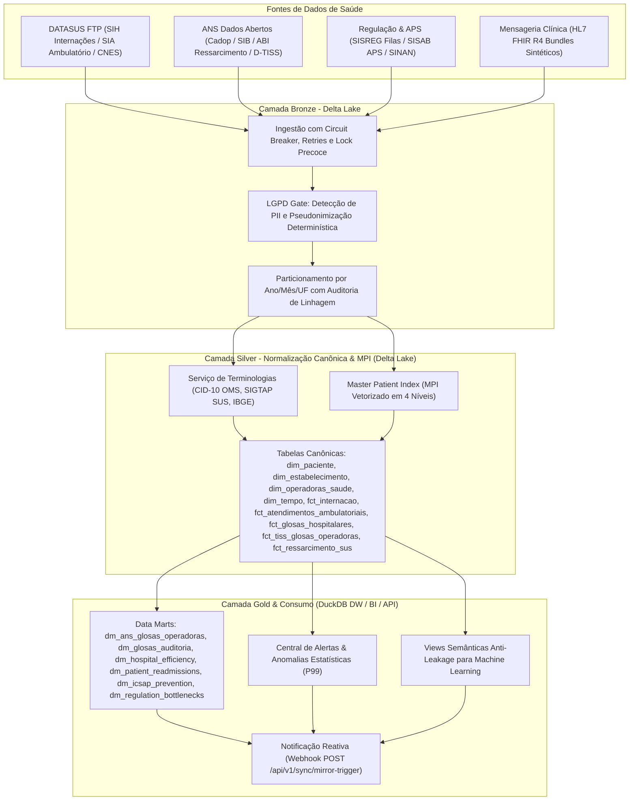

# QIMED DataQore — Pipeline de Dados e Arquitetura Lakehouse

Plataforma de engenharia de dados, interoperabilidade em saúde digital e inteligência hospitalar desenvolvida para ingestão, validação, anonimização e normalização semântica de microdados públicos (**DATASUS**, **ANS**, **SISREG**, **SISAB**) e mensagens clínicas estruturadas (**HL7 FHIR R4**). 

O ecossistema consolida os dados em uma arquitetura Lakehouse transacional baseada em **Delta Lake** (Camadas Bronze e Silver) e **DuckDB Data Warehouse** (Camada Gold) para alimentar modelos analíticos, auditorias de glosas, predições clínicas e dashboards operacionais.

---

## 1. Arquitetura do Sistema

O pipeline segue o padrão de camadas Lakehouse com processamento desacoplado entre computação e armazenamento:



---

## 2. Componentes e Módulos do Sistema

### 2.1. Coletores de Dados (`src/collectors/`)
* **`BaseCollector`**: Classe base abstrata que padroniza o ciclo de vida da ingestão (`fetch` -> `parse` -> `detect_pii` -> `anonymize` -> `validate` -> `write_bronze` -> `register_catalog`). Possui controle de checkpoints, retries com backoff exponencial e circuit breaker.
* **`DatasusCollector`**: Conexão com servidores FTP públicos do DATASUS (`ftp.datasus.gov.br`). Realiza download de arquivos `RD*.dbc` (SIH Internações), `RJ*.dbc` (AIHs Rejeitadas), `ER*.dbc` (Críticas de faturamento), `PA*.dbc` (SIA Ambulatorial) e `ST*.dbc` (CNES Estabelecimentos), com descompressão binária `pyreaddbc` e extração em streaming.
* **`AnsCollector`**: Coleta de cadastros de operadoras (CADOP), beneficiários (SIB), ressarcimento ao SUS (ABI) e notificações de intermediação preliminar (NIP) com tratamento de codificação e modalidades.
* **`TissCollector`**: Extração e parsing de demonstrativos e tabelas de glosas no padrão TISS (Tabela 38 da TUSS/ANS).
* **`SisregCollector`**: Coleta de dados de regulação ambulatorial, filas de espera e solicitações de exames.
* **`FhirSyntheticCollector`**: Gerador de prontuários e encontros clínicos sintéticos em bundles FHIR R4 padronizados.

### 2.2. Segurança, Governança e LGPD (`src/lgpd/`)
* **`PIIDetector`**: Mapeamento declarativo via `config/pii_manifest.yaml` para detecção automática de colunas sensíveis (`NASC`, `N_AIH`, `CPF_AUT`, `CPF_PROF`, nomes, documentos).
* **`Anonymizer`**: Algoritmo de hash criptográfico HMAC SHA-256 alimentado por salt rotativo (`QIMED_MPI_SALT` e `SALT_SECRET`). Assegura persistência relacional sem exposição de dados pessoais.

### 2.3. Resolução de Identidades e Terminologias (`src/mpi/` e `src/silver/`)
* **`PatientIdentityResolver` (Master Patient Index - MPI)**: Resolução determinística em 4 níveis hierárquicos para unificação da jornada do paciente entre hospitais, ambulatórios e saúde suplementar:
  * **Nível 1 (Cartão SUS / CPF):** Linkage exato por identificador primário.
  * **Nível 2 (Atendimento Composto):** Linkage por data de atendimento, nascimento, sexo e município.
  * **Nível 3 (Chave Demográfica Estável):** Linkage por data de nascimento, sexo e município de residência.
  * **Nível 4 (Fallback Determinístico):** Linkage por hash do registro com salvaguarda neonatal para recém-nascidos.
* **Serviço de Terminologias Nacionais**:
  * **CID-10:** Validação de diagnósticos, normalização e agrupamento nos 21 capítulos clínicos da OMS.
  * **SIGTAP (SUS):** Formatação de procedimentos em 10 dígitos (`GG.SS.FF.NNN-D`) e associação a grupos oficiais.
  * **IBGE:** Resolução de 5.570 municípios brasileiros e capitais via base indexada em Parquet.

### 2.4. Camada Gold, Data Marts e Machine Learning (`src/gold/`)
* **`GoldPipelineNacional`**: Consolidação vetorial dos Data Marts no DuckDB DW com otimização out-of-core (`CHECKPOINT` e `VACUUM`).
* **Views Semânticas Anti-Leakage**:
  * `vw_ml_features_admissao`: Apenas covariáveis de entrada disponíveis no momento da internação em t0.
  * `vw_ml_targets_internacao`: Alvos de desfecho pós-alta (óbito hospitalar, permanência prolongada, readmissão).
* **`DataQualityAuditor` (`src/quality/`)**: Auditoria forense automatizada de integridade relacional, consistência temporal e detecção de anomalias estatísticas (P99).

---

## 3. Estrutura de Diretórios do Projeto

```
QIMED/
├── config/                        # Dicionários de domínio estáticos (CID-10, IBGE, PII Manifest)
│   ├── dim_cid10_datasus.parquet  # Tabela de domínio nacional CID-10 OMS
│   ├── dim_municipios_ibge.parquet# Tabela de domínio municipal IBGE
│   ├── pii_manifest.yaml          # Mapeamento de campos sensíveis para LGPD
│   └── pipeline.yaml              # Configuração global de particionamento e storage
├── dags/                          # Matriz de 13 DAGs do Apache Airflow 2.x
│   ├── dag_qimed_end_to_end.py    # Pipeline Master Fim a Fim (27 UFs)
│   ├── dag_datasus_sih.py         # Ingestão de Internações SUS (SIH-RD)
│   ├── dag_datasus_sih_rejeicoes_glosas.py # Ingestão de Glosas e Rejeições (SIH-RJ/ER)
│   ├── dag_datasus_cnes.py        # Ingestão de Estabelecimentos e Leitos (CNES-ST)
│   ├── dag_datasus_sia.py         # Ingestão de Ambulatório SUS (SIA-PA)
│   ├── dag_ans_supplementary_health.py # Ingestão de Operadoras e Ressarcimento ANS
│   ├── dag_fhir_synthetic.py      # Geração e Ingestão de FHIR R4
│   ├── dag_sisreg_regulation.py   # Ingestão de Filas e Regulação SISREG
│   ├── dag_datasus_epidemiology_aps.py # Ingestão de Atenção Primária e SINAN
│   ├── dag_dim_tempo.py           # Geração da Dimensão Calendário (dim_tempo)
│   ├── dag_silver_transformation.py # Transformação Canônica Silver com MPI
│   ├── dag_gold_aggregation.py    # Consolidação de Data Marts no DuckDB DW
│   └── dag_data_quality_audit.py  # Auditoria Forense Automatizada de Qualidade
├── src/                           # Código-fonte modular da plataforma
│   ├── api/                       # Endpoints e guardrails clínicos
│   ├── collectors/                # Coletores de dados (DATASUS, ANS, TISS, FHIR, SISREG)
│   ├── gold/                      # Modelos analíticos, Data Marts e views semânticas
│   ├── ingestion/                 # Writers Delta Lake, Staging Parquet e Lock Manager
│   ├── lakehouse/                 # Abstração de escrita e gerenciamento Delta Lake
│   ├── lgpd/                      # Detecção de PII e pseudonimização determinística
│   ├── metadata/                  # Catálogo de datasets e linhagem
│   ├── mpi/                       # Master Patient Index e resolução de identidades
│   ├── observability/             # Métricas de telemetria e Notificador Webhook
│   ├── pipeline/                  # Orquestrador mestre (QimedMasterPipeline)
│   ├── processing/                # Engine DuckDB e transformações canônicas
│   ├── quality/                   # Auditoria forense de integridade de dados
│   ├── silver/                    # Mappers canônicos e serviços de terminologia
│   └── utils/                     # Carregadores de configuração e logs estruturados
├── tests/                         # Suíte de testes automatizados com pytest (161 testes)
├── docker-compose.yml             # Orquestração do Airflow 2.x com PostgreSQL 13
├── Dockerfile                     # Imagem Docker padronizada da aplicação
├── requirements.txt               # Dependências Python fixadas
└── README.md                      # Documentação técnica do projeto
```

---

## 4. Requisitos de Sistema e Dimensionamento de Hardware

### 4.1. Tabela de Requisitos

| Recurso | Modo Script Standalone (CLI) | Modo Docker + Airflow Cluster |
|---|:---:|:---:|
| **Processador (CPU)** | **2 Núcleos / vCPUs** (x86_64 ou ARM64) | **4 Núcleos / vCPUs** |
| **Memória RAM** | **4 GB** (Pico de uso ~1.2 GB no DuckDB) | **8 GB** (Airflow + PostgreSQL + DuckDB) |
| **Armazenamento** | **10 GB livres (SSD)** | **20 GB livres (SSD)** |
| **Rede** | Acesso HTTP/FTP (`ftp.datasus.gov.br`) | Conexão banda larga estável |
| **Sistema Operacional** | Linux (Ubuntu/Debian), Windows 10/11 ou macOS | Linux, Windows (com WSL2) ou macOS |

### 4.2. Estimativa de Armazenamento em Disco por Escopo
* **1 Estado (ex.: Ceará com 3 meses de histórico):** ~`300 MB` a `600 MB` (Bronze + Silver Delta + DW DuckDB).
* **Brasil Inteiro (27 UFs em 1 competência mensal SIH + SIA + ANS + Glosas):** ~`3 GB` a `6 GB` compactados em Parquet/Delta.

---

## 5. Variáveis de Ambiente (`.env`)

Copie o modelo para criar seu arquivo local:
```bash
cp .env.example .env
```

| Variável | Obrigatória? | Padrão / Exemplo | Descrição |
|---|:---:|---|---|
| `QIMED_MPI_SALT` | **SIM** | `openssl rand -hex 32` | Salt HMAC SHA-256 para anonimização e MPI de pacientes. O pipeline aborta se ausente. |
| `SALT_SECRET` | **SIM** | `openssl rand -hex 32` | Chave de reforço da camada de pseudoanonimização LGPD. |
| `BACKEND_SYNC_WEBHOOK_URL` | NÃO | `http://localhost:8000/api/v1/sync/mirror-trigger` | Endpoint HTTP POST acionado ao término do pipeline para disparar o espelhamento. |
| `LAKEHOUSE_PATH` | NÃO | `lakehouse/bronze` | Caminho raiz da Camada Bronze. |
| `LAKEHOUSE_ROOT` | NÃO | `lakehouse` | Raiz de persistência das camadas Bronze e Silver do Delta Lake. |
| `WAREHOUSE_PATH` | NÃO | `warehouse` | Diretório onde o arquivo OLAP `qimed_dw.duckdb` é gerado. |
| `DATASUS_FTP_HOST` | NÃO | `ftp.datasus.gov.br` | Host oficial do servidor FTP do DATASUS. |
| `LOG_LEVEL` | NÃO | `INFO` | Nível de detalhe dos logs (`DEBUG`, `INFO`, `WARNING`, `ERROR`). |
| `AIRFLOW__WEBSERVER__SECRET_KEY` | NÃO | `qimed_secret_key` | Chave de sessão web do Apache Airflow. |

---

## 6. Parâmetros Operacionais de Execução (Mês, Ano e UF)

### 6.1. Disponibilidade das Fontes Públicas
* **DATASUS (SIH e SIA):** Arquivos `RD*.dbc` e `PA*.dbc` são publicados com **1 a 2 meses de defasagem** (ex.: competência Maio/2026 é publicada entre Junho e Julho/2026).
* **Histórico Disponível:** Suporte a extrações retroativas desde **2015 até o ano corrente**.

### 6.2. Lista de UFs Homologadas
O pipeline aceita qualquer uma das **27 Unidades Federativas** ou a sigla especial `"BR"` (para processar todos os estados em paralelo):
`RO`, `AC`, `AM`, `RR`, `PA`, `AP`, `TO`, `MA`, `PI`, `CE`, `RN`, `PB`, `PE`, `AL`, `SE`, `BA`, `MG`, `ES`, `RJ`, `SP`, `PR`, `SC`, `RS`, `MS`, `MT`, `GO`, `DF`.

---

## 7. Como Executar

### Opção A: Execução Standalone via CLI (Rápida e Leve)

1. Crie e ative o ambiente virtual:
```bash
python -m venv .venv
source .venv/bin/activate   # Windows: .venv\Scripts\activate
pip install -r requirements.txt
cp .env.example .env
```

2. Execute o pipeline nacional com parâmetros customizados:
```bash
# Executa o pipeline para todas as 27 UFs
python scripts/run_national_pipeline.py

# Executa suíte completa de testes automatizados
pytest tests/ -v
```

---

### Opção B: Orquestração Completa via Apache Airflow (Docker Compose)

1. Suba os contêineres:
```bash
docker compose up -d
```

2. Acesse a interface web em `http://localhost:8088` (ou `http://localhost:8080`):
   * **Usuário:** `admin` | **Senha:** `admin`

3. Disparar DAG com parâmetros customizados via REST API:
```bash
curl -X POST "http://localhost:8088/api/v1/dags/qimed_master_pipeline_end_to_end/dagRuns" \
  -H "Content-Type: application/json" \
  -H "Authorization: Basic YWRtaW46YWRtaW4=" \
  -d '{
    "conf": {
      "uf": "CE",
      "year": 2026,
      "month": 5,
      "force_reprocess": false
    }
  }'
```

---

## 8. Modelo de Dados Canônico em Português

### 8.1. Camada Silver (Delta Lake em `lakehouse/silver/`)
* **`dim_paciente`**: Entidade paciente unificada via Master Patient Index (MPI), dados demográficos e hash de linkage.
* **`dim_estabelecimento`**: Cadastro de hospitais, clínicas e unidades de saúde com código CNES e capacidade de leitos.
* **`dim_operadoras_saude`**: Cadastro oficial de operadoras ANS, porte, modalidade e segmentação.
* **`dim_tempo`**: Calendário canônico com datas, dias úteis, trimestres e semestres.
* **`fct_internacao`**: Fato de internações hospitalares SUS (SIH-RD) com diagnósticos, procedimentos, permanência e valores.
* **`fct_atendimentos_ambulatoriais`**: Fato de procedimentos ambulatoriais SUS (SIA-PA).
* **`fct_glosas_hospitalares`**: Fato de AIHs rejeitadas (`SIH-RJ`) e relatórios de críticas (`SIH-ER`).
* **`fct_tiss_glosas_operadoras`**: Fato transacional de guias e demonstrativos de saúde suplementar (TISS).
* **`fct_ressarcimento_sus`**: Cobranças de atendimentos de beneficiários de planos em hospitais públicos (ABI/ANS).
* **`fct_regulacao_filas`**: Fila de espera e tempos de atendimento do SISREG.

### 8.2. Camada Gold (Data Marts no DuckDB DW em `warehouse/qimed_dw.duckdb`)
* **`dm_ans_glosas_operadoras`**: Indicadores do Painel TISS da ANS (Notas Técnicas 18 e 25/2020) com suporte a detecção de outliers.
* **`dm_glosas_auditoria`**: Auditoria consolidada de glosas e motivos de recusa hospitalar.
* **`dm_hospital_efficiency`**: Eficiência de leitos, giro e taxa de ocupação hospitalar.
* **`dm_patient_readmissions`**: Taxa de readmissão precoce em 30 dias.
* **`dm_icsap_prevention`**: Internações por Condições Sensíveis à Atenção Primária.
* **`dm_regulation_bottlenecks`**: Gargalos e tempo de espera na regulação.
* **`aud_alertas_anomalias`**: Central forense de alertas e anomalias de faturamento (P99).
